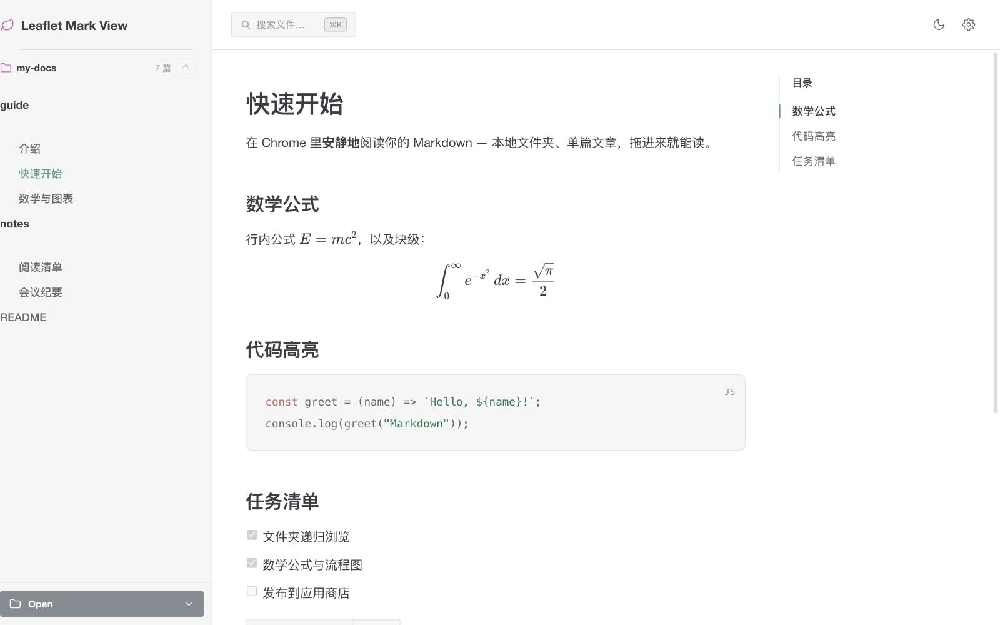
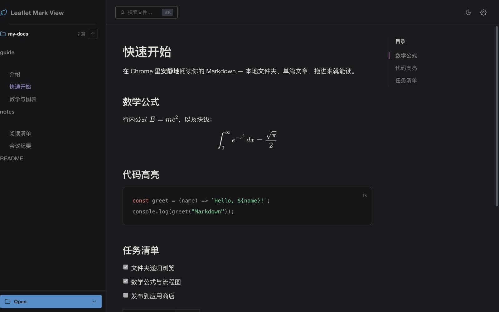
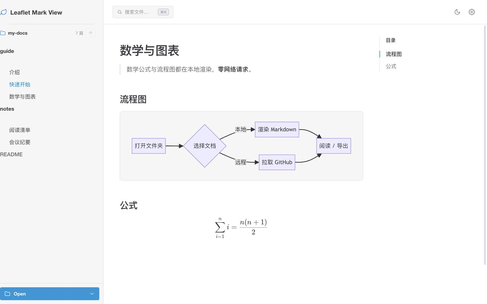
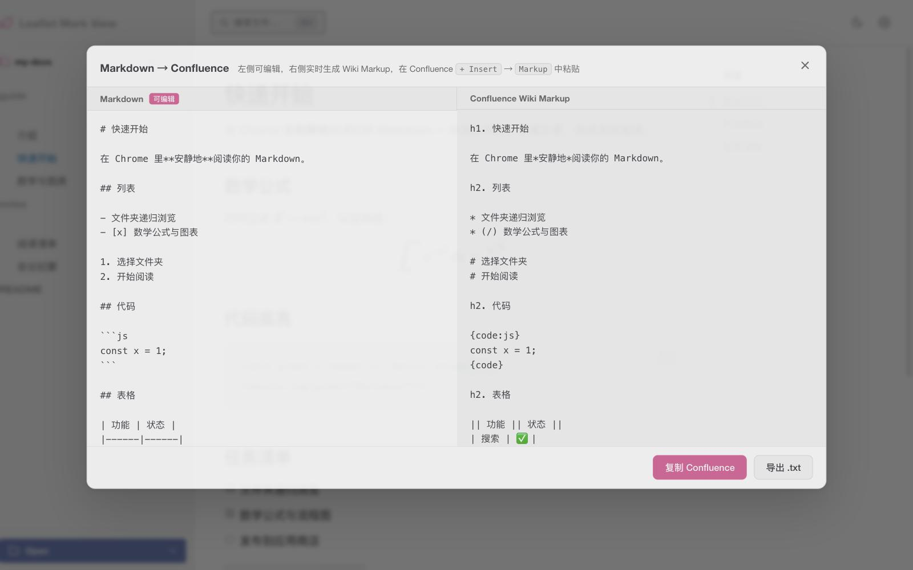

# Leaflet Mark View

[](https://github.com/whisper-xiang/leaflet-mark-view/releases/latest)

在 Chrome 里，安静地读你的 Markdown。

> 本地文件夹、单篇文章、GitHub 远程仓库，拖进来就能读。本地渲染为主，不上传任何文件。

**[下载最新版](https://github.com/whisper-xiang/leaflet-mark-view/releases/latest)** — 获取 `leaflet-mark-view.zip`，解压后在 Chrome 扩展页加载（见下方「快速开始」）。


## 截图

### 阅读器

浅色 / 深色主题，侧边栏树形目录、全文搜索、大纲导航、KaTeX 公式、代码高亮、任务清单一应俱全。

<p align="center">
  
  <br><br>
  
</p>

### 数学公式与流程图

Mermaid 流程图、LaTeX 公式均在本地渲染，无需联网。

<p align="center">
  
</p>

### 转 Confluence

设置 → **转换为 Confluence**，左侧可编辑 Markdown，右侧实时生成 Wiki Markup，支持复制与导出。

<p align="center">
  
</p>


## 快速开始

### 安装（开发者模式）

**方式 A：下载 Release（推荐）**

1. 打开 [Releases](https://github.com/whisper-xiang/leaflet-mark-view/releases/latest)，下载 `leaflet-mark-view.zip`
2. 解压到任意目录
3. Chrome 打开 `chrome://extensions/`
4. 右上角开启 **开发者模式**
5. 点击 **加载已解压的扩展程序**，选择解压后的目录

**方式 B：克隆源码**

```bash
git clone https://github.com/whisper-xiang/leaflet-mark-view.git
cd leaflet-mark-view
```

然后在 `chrome://extensions/` 开启开发者模式，加载项目根目录。

本地打包（可选）：

```bash
./build.sh   # 生成 leaflet-mark-view.zip
```

### 必须开启：允许访问文件网址

扩展详情页 → **允许访问文件网址**（Allow access to file URLs）

不开启则无法拦截本地 `.md` 文件，也无法读取同目录下的图片等资源。

### 设置双击 `.md` 文件直接用本扩展打开

原理：将 Chrome 设为 `.md` 文件的默认应用，系统双击时会以 `file://` 路径在 Chrome 中打开，扩展自动拦截并渲染。

**macOS**

1. 在 Finder 中找到任意一个 `.md` 文件
2. 右键 → **显示简介**（或 `⌘I`）
3. 展开 **打开方式**，在下拉列表中选择 **Google Chrome**
4. 点击 **全部更改…** → 确认

之后双击任何 `.md` 文件，Chrome 会打开该文件的 `file://` URL，扩展自动跳转到阅读器。

**Windows**

1. 右键任意 `.md` 文件 → **打开方式** → **选择其他应用**
2. 选择 **Google Chrome**，勾选 **始终使用此应用打开 .md 文件**
3. 确认

**前提**：扩展已安装，且已开启 **允许访问文件网址**（见上方安装说明）。


## 使用

### 打开方式

| 方式 | 操作 |
|------|------|
| 新标签页主页 | 安装后默认接管 Chrome 新标签页；可在扩展弹窗关闭 |
| 扩展弹窗 | 点击工具栏图标 → **打开阅读器** |
| 文件夹 | 主页 / 阅读器侧栏 **Open → Open Folder**，递归扫描全部 `.md` |
| 单文件 | **Open → Open File**，支持 `.md` / `.markdown` / `.mdown` / `.mkd` |
| 远程链接 | **Open → Open URL**，粘贴 GitHub 仓库 / 文件页 / raw 直链 / 其他 `.md` 直链 |
| 拖拽 | 把文件夹或 `.md` 文件拖到主页或阅读器，松手即开 |
| 直接打开 | 在浏览器地址栏输入 `file://` 路径，扩展自动跳转渲染 |
| 继续阅读 | 主页点击 **继续阅读**，悬停可展开最近阅读列表 |

> **远程访问按需授权**：GitHub（`raw.githubusercontent.com` / `api.github.com`）已内置。打开其他网站的 `.md` 直链时，首次会弹出授权框，仅授予你确认的那个域名——扩展默认不持有「访问所有网站」的权限。

### 阅读器操作

| 操作 | 快捷键 / 位置 |
|------|--------------|
| 全文搜索 | `Ctrl+K` / `⌘K`，或顶栏搜索框 |
| 切换主题 | 顶栏月亮 / 太阳图标（带视图过渡动画） |
| 字体大小 / 大纲 / 背景图 | 顶栏设置齿轮 |
| 折叠侧边栏 | 顶栏左侧图标 |
| 固定文件夹 | 侧栏顶部图钉，固定后顶栏出现快捷分类 Tab |
| 上一篇 / 下一篇 | 右下角浮动翻页按钮，或正文底部上一篇 / 下一篇卡片 |
| 文档内跳转 | 点指向其他 `.md` 的相对链接，在阅读器内直接打开；脚注 / 页内锚点同页平滑滚动 |
| 复制代码 | 鼠标悬停代码块，点击右上角复制按钮 |
| 转 Confluence | 设置齿轮 → **转换为 Confluence**，弹框内可复制 / 导出 `.txt` |
| 浏览器打开 | 设置齿轮 → **浏览器渲染**，在新标签页以原生方式查看当前 Markdown |
| 在系统中定位 | 侧栏文件树右键 → 在系统文件选择器中打开所在目录 |
| 回到主页 | 点击左上角 **Leaflet Mark View** Logo |

### 扩展弹窗设置

| 选项 | 说明 |
|------|------|
| 接管新标签页 | 开启时新标签页显示水墨风主页；关闭后新标签页跳转 Google（弹窗 **打开阅读器** 仍可进入主页） |

### 主页个性化

右上角设置按钮可 **选择本地图片** 作为背景，或 **恢复默认背景**（水墨风内置图）。背景偏好保存在本地 IndexedDB，主页与阅读器同步。


## 功能一览

### 入口与文件来源

- **全屏主页** — 水墨风背景，鼠标移入淡出操作区；可自定义背景图
- **新标签页接管** — 可选开启 / 关闭，弹窗一键切换
- **本地文件夹** — File System Access API 递归扫描，树形目录展开浏览
- **本地单文件** — 独立打开；若同目录有其他 `.md`，自动补全侧栏列表
- **`file://` 拦截** — Content Script 自动捕获浏览器直接打开的 `.md`，跳转阅读器
- **远程 GitHub** — 仓库链接打开 README；`blob` / `tree` / raw 直链均可；侧栏列出仓库内全部 `.md`
- **通用远程直链** — 任意 `https` 的 `.md` 文件，首次按需授权对应域名
- **拖拽打开** — 主页与阅读器均支持文件夹 / 文件拖放；拖入 `.html` 则在新标签页打开
- **最近阅读** — IndexedDB 记录最近 20 条（本地文件夹 / 文件 / 远程链接），主页一键继续
- **会话恢复** — 再次进入阅读器时自动恢复上次打开的文件夹；权限过期时显示重连横幅

### 阅读体验

- **全文搜索** — `Ctrl+K` / `⌘K` 弹框搜索，同时匹配文件名与正文，命中片段高亮，路径面包屑导航
- **大纲导航** — 自动提取 h2–h4 生成目录，滚动跟随高亮，点击平滑定位，侧栏宽度可拖拽调节
- **阅读进度条** — 顶栏细线随滚动进度延伸（纯 CSS 实现）
- **阅读记忆** — 记住每个文件的上次阅读位置与最后打开文件，下次自动恢复
- **上下篇导航** — 按文件列表顺序切换，浮动按钮 + 正文底部卡片双入口
- **深 / 浅色主题** — 带 View Transition 动画的主题切换
- **字体大小** — 小 / 中 / 大 / 特大四档
- **背景图开关** — 阅读器内可单独开关装饰背景
- **固定快捷入口** — 将常用文件夹固定到侧栏图钉，顶栏生成 Feed Tab；支持重命名、移除，有子目录时下拉快速打开

### Markdown 渲染

- **GFM 兼容** — 管道表格与 HTML `<table>`、任务列表、删除线、脚注、emoji 短名（`:smile:` 等）
- **YAML Front Matter** — 文首元数据渲染为信息卡片
- **数学公式** — `$…$` / `$$…$$` 由 KaTeX 本地按需加载渲染
- **流程图** — ` ```mermaid ` 代码块由 Mermaid 渲染，随深浅主题切换
- **代码高亮** — 内置 JS / TS / Python / Go / Java / Bash / CSS / SQL 等关键字高亮
- **代码复制** — 代码块悬停显示一键复制
- **可拖拽表格** — 渲染后的表格列宽可拖拽调整，双击表头自动适配内容宽度
- **标题锚点** — VitePress 风格 permalink，中文标题生成有效锚点 ID
- **站内跳转** — 文件夹内 `.md` 相对链接、脚注、页内锚点均在阅读器内导航，不另开标签页
- **本地图片** — 相对路径与 `file://` 图片通过 Blob URL 正确显示

### 导出与工具

- **转 Confluence** — 将当前文档转为 Confluence Wiki Markup；左侧 Markdown 可编辑，右侧实时预览，支持一键复制与导出 `.confluence.txt`
- **浏览器渲染** — 以 Blob URL 在新标签页打开原始 Markdown

### 隐私与安全

- **本地优先** — Markdown 解析、公式、图表均在浏览器本地完成，不上传文件
- **最小权限** — 仅 `storage` 必选权限；GitHub 域名预授权；其他网站按需单次授权
- **数据本地存储** — 阅读记录、固定文件夹、自定义背景等存于 IndexedDB / localStorage，不上传云端


## 项目结构

```
leaflet-mark-view/
├── manifest.json          # Chrome 扩展清单（Manifest V3）
├── background.js          # Service Worker：tab 跳转、session 存储权限
├── content.js             # 拦截 file:// 下的 .md 页面
├── newtab-gate.js         # 新标签页接管开关
├── home.html / home.js    # 全屏主页
├── viewer.html / viewer.js / viewer.css   # 阅读器主界面
├── popup.html / popup.js  # 扩展弹窗
├── markdown.js            # GFM Markdown 解析器
├── md-to-confluence.js    # Markdown → Confluence Wiki Markup
├── lmv-db.js              # IndexedDB：句柄、最近阅读、固定文件夹、背景图
├── remote-md.js           # 远程 Markdown（GitHub API / 直链）
├── vendor/                # 内置 KaTeX、Mermaid（离线可用）
├── icons/                 # 扩展图标
├── public/                # 默认背景与截图资源
└── tests/                 # 解析器回归测试
```


## 开发与测试

```bash
# Markdown 解析器测试
node tests/markdown.test.mjs

# Confluence 转换测试
node tests/confluence.test.mjs

# 打包扩展
./build.sh
```

测试无第三方依赖，直接 `node` 运行即可。


## 安装要求

- Google Chrome（或 Chromium 内核浏览器，如 Edge）**116+**
- 需要浏览器支持 [File System Access API](https://developer.mozilla.org/en-US/docs/Web/API/File_System_Access_API)（`showDirectoryPicker`）
- 阅读本地文件需开启扩展的 **允许访问文件网址**

---

作者：轻语 · [Releases](https://github.com/whisper-xiang/leaflet-mark-view/releases)
