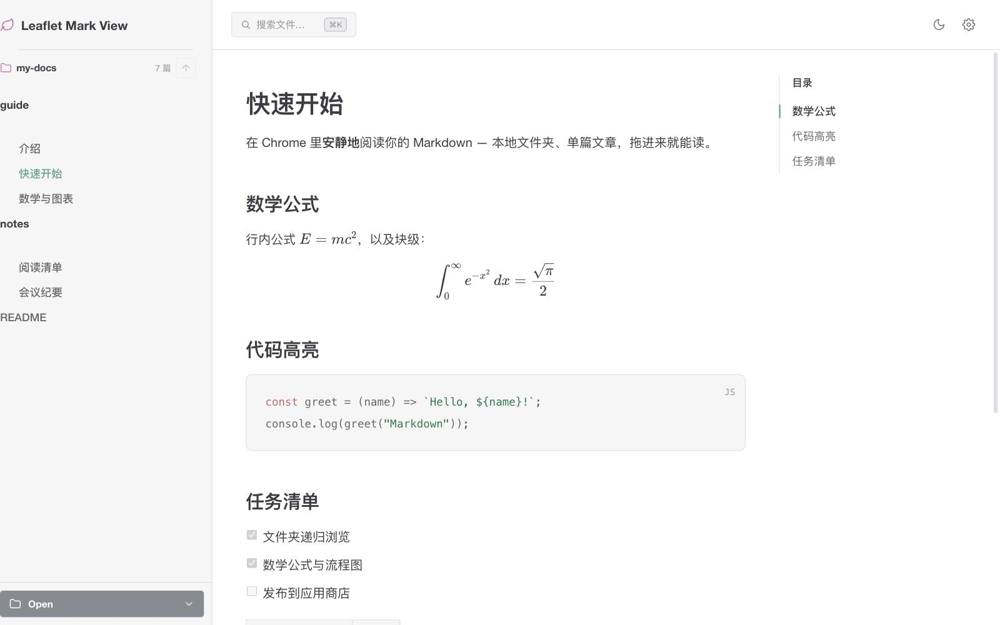
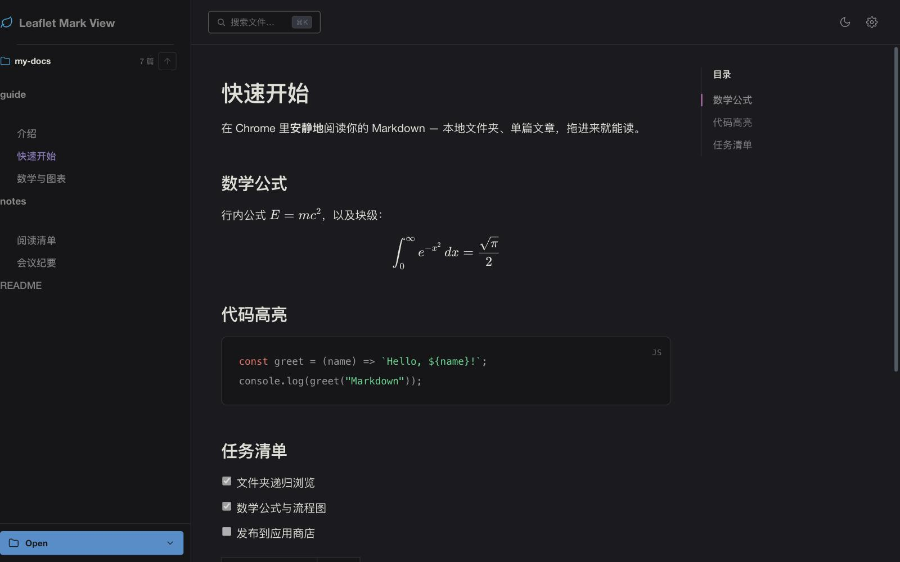
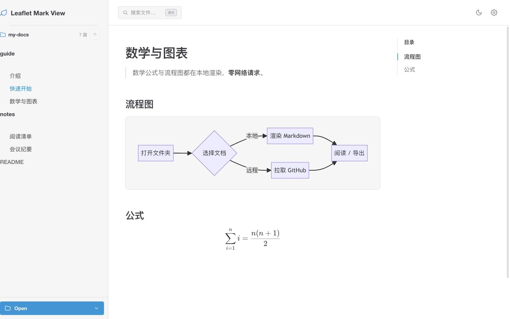
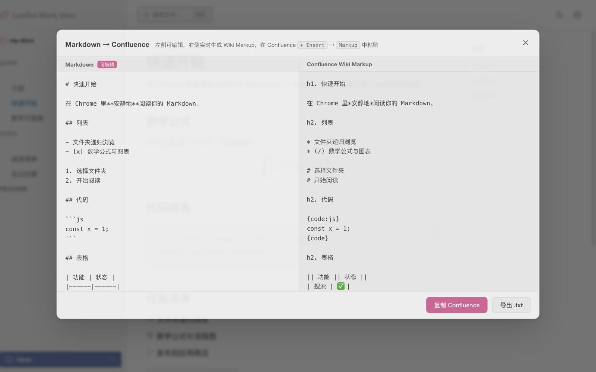

# Leaflet Mark View

[](https://github.com/whisper-xiang/leaflet-mark-view/releases/latest)

在 Chrome 里，安静地读你的 Markdown。

> 本地文件夹、单篇文章、GitHub 远程仓库，拖进来就能读。本地渲染为主，不上传任何文件。

**[下载最新版 v1.4.0](https://github.com/whisper-xiang/leaflet-mark-view/releases/latest)** — 获取 `leaflet-mark-view.zip`，解压后在 Chrome 扩展页加载（见下方「快速开始」）。Chrome 网上应用店上架材料与提交步骤见 [`store/`](store/README.md)。

### v1.4.0 更新

- **复制 HTML / 导出 Word** — 设置中可将当前文档转为带内联样式的浅色 HTML（可粘贴到公众号 / 飞书 / 邮件），或本地生成 A4 `.docx`
- **阅读主题** — 默认 / 羊皮纸 / 青纸 / 深色 / 夜墨 五套阅读配色
- **正文字体** — 黑体 / 宋体可切换


## 截图

### 阅读器

浅色 / 深色主题，侧边栏树形目录、全文搜索、大纲导航、KaTeX 公式、代码高亮、任务清单一应俱全。

<p align="center">
  
  <br><br>
  
</p>

### 数学公式与流程图

Mermaid 流程图、PlantUML、LaTeX 公式均在本地渲染，无需联网。点击图片或图表可放大预览。

<p align="center">
  
</p>

### 转 Confluence

设置 → **导出** → **转换为 Confluence**，左侧可编辑 Markdown，右侧实时生成 Wiki Markup，支持复制与导出。

<p align="center">
  
</p>


## 快速开始

### 安装（开发者模式）

**方式 A：下载 Release（推荐）**

1. 打开 [Releases](https://github.com/whisper-xiang/leaflet-mark-view/releases/latest)，下载 `leaflet-mark-view.zip`
2. 解压到任意目录
3. Chrome 打开 `chrome://extensions/`
4. 右上角开启 **开发者模式**
5. 点击 **加载已解压的扩展程序**，选择解压后的目录

**方式 B：克隆源码**

```bash
git clone https://github.com/whisper-xiang/leaflet-mark-view.git
cd leaflet-mark-view
```

然后在 `chrome://extensions/` 开启开发者模式，加载项目根目录。

本地打包（可选）：

```bash
./build.sh   # 生成 leaflet-mark-view.zip
```

### 必须开启：允许访问文件网址

扩展详情页 → **允许访问文件网址**（Allow access to file URLs）

不开启则无法拦截本地 `.md` 文件，也无法读取同目录下的图片等资源。

### 设置双击 `.md` 文件直接用本扩展打开

原理：将 Chrome 设为 `.md` 文件的默认应用，系统双击时会以 `file://` 路径在 Chrome 中打开，扩展自动拦截并渲染。

**macOS**

1. 在 Finder 中找到任意一个 `.md` 文件
2. 右键 → **显示简介**（或 `⌘I`）
3. 展开 **打开方式**，在下拉列表中选择 **Google Chrome**
4. 点击 **全部更改…** → 确认

之后双击任何 `.md` 文件，Chrome 会打开该文件的 `file://` URL，扩展自动跳转到阅读器。

**Windows**

1. 右键任意 `.md` 文件 → **打开方式** → **选择其他应用**
2. 选择 **Google Chrome**，勾选 **始终使用此应用打开 .md 文件**
3. 确认

**前提**：扩展已安装，且已开启 **允许访问文件网址**（见上方安装说明）。阅读器空状态的「查看步骤」、设置 → **使用说明** 也会打开本节。


## 使用

### 打开方式

| 方式 | 操作 |
|------|------|
| 工具栏图标 | 点击扩展图标打开阅读器起始页 |
| 文件夹 | 阅读器起始页 / 侧栏 **Open → Open Folder**，递归扫描全部 `.md` |
| 单文件 | **Open → Open File**，支持 `.md` / `.markdown` / `.mdown` / `.mkd` |
| 远程链接 | **Open → Open URL**，粘贴 GitHub 仓库 / 文件页 / raw 直链 / 其他 `.md` 直链 |
| 拖拽 | 把文件夹或 `.md` 文件拖到阅读器，松手即开 |
| 双击打开 | 将 Chrome 设为 `.md` 默认应用，并开启「允许访问文件网址」，见上方步骤 |
| 继续阅读 | 顶栏右侧 **最近阅读** 下拉，可一键继续或从列表移除 |

### 背景图

阅读器默认显示背景图。右上角 **设置** 中可开关、**选择背景图** 或 **恢复默认背景**。偏好保存在本地。

> **远程访问按需授权**：GitHub（`raw.githubusercontent.com` / `api.github.com`）已内置。打开其他网站的 `.md` 直链时，首次会弹出授权框，仅授予你确认的那个域名——扩展默认不持有「访问所有网站」的权限。

### 阅读器操作

| 操作 | 快捷键 / 位置 |
|------|--------------|
| 全文搜索 | `Ctrl+K` / `⌘K`，或顶栏搜索框 |
| 切换主题 | 顶栏月亮 / 太阳图标（浅色系 ↔ 深色系，带视图过渡动画） |
| 字体大小 / 阅读主题 / 正文字体 | 顶栏设置齿轮 → **主题** |
| 大纲 / 背景图 | 顶栏设置齿轮 |
| 折叠侧边栏 | 顶栏左侧图标 |
| 固定文件夹 | 侧栏顶部图钉，固定后顶栏出现快捷分类 Tab |
| 最近阅读 | 顶栏右侧 **最近阅读**，悬停打开；点条目继续，点 × 从列表移除 |
| 上一篇 / 下一篇 | 右下角浮动翻页按钮，或正文底部上一篇 / 下一篇卡片 |
| 文档内跳转 | 点指向其他 `.md` 的相对链接，在阅读器内直接打开；脚注 / 页内锚点同页平滑滚动 |
| 复制代码 | 鼠标悬停代码块，点击右上角复制按钮 |
| 图表源码切换 | Mermaid / PlantUML 图右上角切换预览与源码，可复制 |
| 图片 / 图表放大 | 点击正文图片或图表预览，全屏查看（滚轮缩放、拖拽、Esc 关闭） |
| 转 Confluence | 设置齿轮 → **导出** → **转换为 Confluence**，弹框内可复制 / 导出 `.txt` |
| 复制 HTML | 设置齿轮 → **导出** → **复制 HTML**，弹框内可复制 / 导出 `.html` |
| 导出 Word | 设置齿轮 → **导出** → **导出 Word**，弹框内可导出 `.docx` |
| 浏览器打开 | 设置齿轮 → **浏览器渲染**，在新标签页以原生方式查看当前 Markdown |
| 在系统中定位 | 侧栏文件树右键 → 在系统文件选择器中打开所在目录 |
| 回到起始页 | 点击左上角 **Leaflet Mark View** Logo |


## 功能一览

### 入口与文件来源

- **阅读器起始页** — 直接在阅读器内打开文件夹、单篇、远程链接或最近内容
- **本地文件夹** — File System Access API 递归扫描，树形目录展开浏览
- **本地单文件** — 独立打开；若同目录有其他 `.md`，自动补全侧栏列表
- **`file://` 拦截** — Content Script 自动捕获浏览器直接打开的 `.md`，跳转阅读器
- **远程 GitHub** — 仓库链接打开 README；`blob` / `tree` / raw 直链均可；侧栏列出仓库内全部 `.md`
- **通用远程直链** — 任意 `https` 的 `.md` 文件，首次按需授权对应域名
- **拖拽打开** — 阅读器支持文件夹 / 文件拖放；拖入 `.html` 则在新标签页打开
- **最近阅读** — IndexedDB 记录最近 20 条（本地文件夹 / 文件 / 远程链接），顶栏下拉一键继续，可从列表移除
- **会话恢复** — 再次进入阅读器时自动恢复上次打开的文件夹；权限过期时显示重连横幅

### 阅读体验

- **全文搜索** — `Ctrl+K` / `⌘K` 弹框搜索，同时匹配文件名与正文，命中片段高亮，路径面包屑导航
- **大纲导航** — 自动提取 h2–h4 生成目录，滚动跟随高亮，点击平滑定位，侧栏宽度可拖拽调节
- **阅读进度条** — 顶栏细线随滚动进度延伸（纯 CSS 实现）
- **阅读记忆** — 记住每个文件的上次阅读位置与最后打开文件，下次自动恢复
- **上下篇导航** — 按文件列表顺序切换，浮动按钮 + 正文底部卡片双入口
- **深 / 浅色主题** — 带 View Transition 动画的主题切换；设置中可循环 **默认 / 羊皮纸 / 青纸 / 深色 / 夜墨**
- **正文字体** — 黑体 / 宋体
- **字体大小** — 小 / 中 / 大 / 特大四档
- **背景图开关** — 默认显示装饰背景，阅读器内可单独开关、更换或恢复默认
- **固定快捷入口** — 将常用文件夹固定到侧栏图钉，顶栏生成 Feed Tab；支持重命名、移除，有子目录时下拉快速打开

### Markdown 渲染

- **GFM 兼容** — 管道表格与 HTML `<table>`、任务列表、删除线、脚注、emoji 短名（`:smile:` 等）
- **YAML Front Matter** — 文首元数据渲染为信息卡片
- **数学公式** — `$…$` / `$$…$$` 由 KaTeX 本地按需加载渲染
- **流程图** — ` ```mermaid ` 代码块由 Mermaid 本地渲染，随深浅主题切换；可切换预览 / 源码
- **PlantUML** — ` ```plantuml ` / ` ```puml ` 由内置 [@plantuml/core](https://www.npmjs.com/package/@plantuml/core) 引擎本地渲染（与 [plantuml.com](https://plantuml.com/zh/) 官网同源 JS 引擎，不上传、不依赖外网）；可切换预览 / 源码并复制
- **图片 / 图表放大** — 点击正文图片、Mermaid、PlantUML 预览全屏查看；滚轮缩放、拖拽平移、Esc 关闭
- **失败占位** — 图片无法加载、Mermaid / PlantUML / 公式渲染失败时显示原因，而不是空白块
- **代码高亮** — 内置 JS / TS / Python / Go / Java / Bash / CSS / SQL 等关键字高亮
- **代码复制** — 代码块悬停显示一键复制
- **可拖拽表格** — 渲染后的表格列宽可拖拽调整，双击表头自动适配内容宽度
- **标题锚点** — VitePress 风格 permalink，中文标题生成有效锚点 ID
- **站内跳转** — 文件夹内 `.md` 相对链接、脚注、页内锚点均在阅读器内导航，不另开标签页
- **本地图片** — 相对路径与 `file://` 图片通过 Blob URL 正确显示

### 导出与工具

- **转 Confluence** — 将当前文档转为 Confluence Wiki Markup；左侧 Markdown 可编辑，右侧实时预览，支持一键复制与导出 `.confluence.txt`；原生 HTML 表格（含合并单元格）一并转换
- **复制 HTML** — 将当前文档转为带内联样式的浅色文章 HTML，可复制到公众号 / 飞书 / 邮件，或导出 `.html`；排版不跟随阅读主题
- **导出 Word** — 本地生成 A4 `.docx`（标题黑体、正文宋体）；Markdown 表与原生 HTML 合并单元格表均可导出；图片以说明 + 链接写入，不嵌入、不上传
- **浏览器渲染** — 以 Blob URL 在新标签页打开原始 Markdown

### 隐私与安全

- **本地优先** — Markdown 解析、公式、Mermaid、PlantUML 均在浏览器本地完成，不上传本地文件
- **最小权限** — 仅 `storage` 必选权限；GitHub 域名预授权；其他网站按需单次授权
- **数据本地存储** — 阅读记录、固定文件夹、自定义背景等存于 IndexedDB / localStorage，不上传云端
- **[隐私政策](PRIVACY.md)** — Chrome 网上应用店所需的数据处理说明


测试无第三方依赖，直接 `node` 运行即可。


## Chrome 网上应用店

商店图标、1280×800 截图、宣传图、中英文案、隐私政策勾选稿与审核测试步骤已备在 [`store/`](store/README.md)。按该目录的清单注册开发者账号、推送本仓库（使 [隐私政策](PRIVACY.md) 可公网访问）后即可上传 `./build.sh` 打出的 zip。


## 安装要求

- Google Chrome（或 Chromium 内核浏览器，如 Edge）**116+**
- 需要浏览器支持 [File System Access API](https://developer.mozilla.org/en-US/docs/Web/API/File_System_Access_API)（`showDirectoryPicker`）
- 阅读本地文件需开启扩展的 **允许访问文件网址**

---

作者：轻语 · [Releases](https://github.com/whisper-xiang/leaflet-mark-view/releases)
